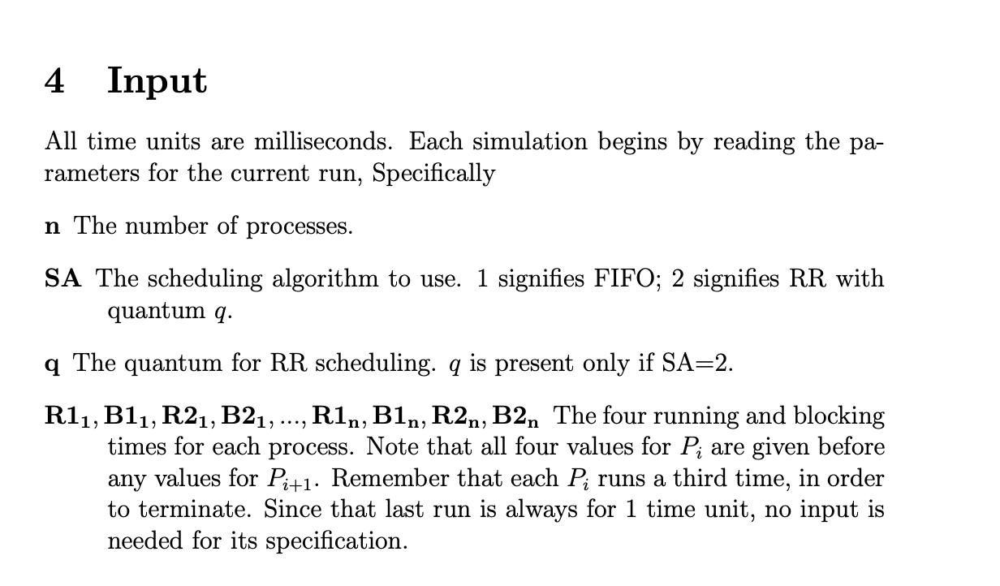

# Process Scheduling Simulation

This program simulates the First In First Out (FIFO) and the Round Robin (RR) process scheduling systems.

To compile my program you must execute this command:

`gcc lab1.c -o processScheduling`

To run the program you must execute this command:

`./processScheduling < input.in`

This `input.in` file you can create or use the ones given in this repository. The scheme to create your own input can be found in the attached image.

input scheme: n SA q R1_1 B1_1 R2_1 B2_1 ... R1_n B1_n R2_n B2_n

`input1.in` simulates FIFO while `input2.in` simulates RR.

The file lab1.c drives the program, rr.h simulates the round robin, and queue.h holds the queue needed for the round robin, as well as, defines the Process structure.
